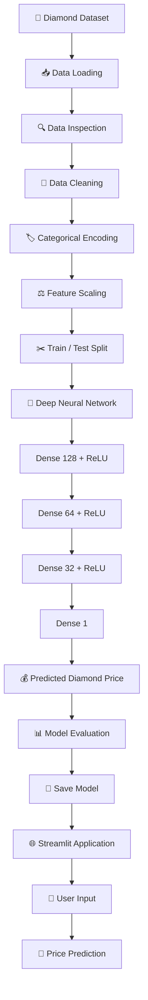
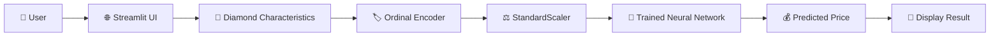

# 💎 Diamond Price Predictor

<p align="center">
  
  
  
  
  
</p>

<p align="center">
  <strong>💎 An AI-powered Deep Learning application for predicting diamond prices from diamond characteristics.</strong>
</p>

<p align="center">
  
  
  
  
</p>

---

## 📌 Overview

**Diamond Price Predictor** is a Deep Learning-based regression project that predicts the price of a diamond based on its physical and quality characteristics.

The model takes features such as:

* 💎 Carat
* ✨ Cut
* 🎨 Color
* 🔍 Clarity
* 📐 Depth
* 📏 Table
* ↔️ Length (`x`)
* ↔️ Width (`y`)
* 📦 Depth (`z`)

and produces an estimated diamond price.

The trained model is integrated into an interactive **Streamlit web application**, allowing users to enter diamond specifications and receive a price prediction.

---

# 🎯 Project Objective

The goal of this project is to build a Deep Learning regression model capable of learning the relationship between diamond characteristics and their market price.

### Target

```text
price
```

### Problem Type

```text
Supervised Learning → Regression
```

---

# 🧠 Architecture



---

# 🔬 Machine Learning Pipeline

```text
💎 Diamond Dataset
        ↓
📊 Data Exploration
        ↓
🧹 Data Cleaning
        ↓
🏷️ Ordinal Encoding
        ↓
⚖️ Standard Scaling
        ↓
✂️ Train / Test Split
        ↓
🧠 Neural Network
        ↓
🏋️ Model Training
        ↓
📈 Evaluation
        ↓
💾 Model Serialization
        ↓
🌐 Streamlit Deployment
```

---

# 📊 Dataset

The project uses the **Diamonds dataset** downloaded using KaggleHub.

Dataset source:

```python
kagglehub.dataset_download("shivam2503/diamonds")
```

The dataset is loaded from:

```text
diamonds.csv
```

---

# 🧹 Data Cleaning

The notebook performs data cleaning before model training.

### Removed Dataset Artifact

The following unnecessary column is removed:

```text
Unnamed: 0
```

### Invalid Dimensions

Rows where any of the following dimensions are zero are removed:

```text
x = 0
y = 0
z = 0
```

This prevents physically impossible diamond dimensions from entering the training process.

---

# 🏷️ Feature Encoding

The dataset contains three categorical quality attributes:

### Cut

```text
Fair
Good
Very Good
Premium
Ideal
```

### Color

```text
J → I → H → G → F → E → D
```

### Clarity

```text
I1 → SI2 → SI1 → VS2 → VS1 → VVS2 → VVS1 → IF
```

These features are transformed using:

```python
OrdinalEncoder()
```

This preserves the intended ordered relationship between quality grades.

---

# ⚖️ Feature Scaling

After categorical encoding, the features are standardized using:

```python
StandardScaler()
```

The transformation allows the neural network to work with features on comparable scales.

---

# 🧠 Deep Learning Model

The project uses a fully connected **Artificial Neural Network** built using TensorFlow/Keras.

### Architecture

```text
Input
  │
  ▼
Dense Layer
128 Neurons
ReLU
  │
  ▼
Dense Layer
64 Neurons
ReLU
  │
  ▼
Dense Layer
32 Neurons
ReLU
  │
  ▼
Output Layer
1 Neuron
  │
  ▼
💰 Price
```

### Model Code

```python
model = Sequential([
    Dense(128, activation='relu',
          input_shape=(X_train.shape[1],)),

    Dense(64, activation='relu'),

    Dense(32, activation='relu'),

    Dense(1)
])
```

---

# ⚙️ Model Configuration

| Parameter        | Value               |
| ---------------- | ------------------- |
| Model Type       | Deep Neural Network |
| Task             | Regression          |
| Framework        | TensorFlow / Keras  |
| Hidden Layers    | 3                   |
| Neurons          | 128 → 64 → 32       |
| Activation       | ReLU                |
| Output Layer     | 1 neuron            |
| Optimizer        | Adam                |
| Loss             | Mean Squared Error  |
| Metric           | Mean Absolute Error |
| Epochs           | 50                  |
| Batch Size       | 32                  |
| Validation Split | 20%                 |
| Test Size        | 20%                 |
| Random State     | 42                  |

---

# 🏋️ Model Training

The neural network is trained using:

```python
history = model.fit(
    X_train,
    y_train,
    epochs=50,
    batch_size=32,
    validation_split=0.2,
    verbose=1
)
```

During training, the project tracks:

* Training Loss
* Validation Loss
* Training MAE
* Validation MAE

---

# 📈 Model Evaluation

The trained model is evaluated against the unseen test dataset.

```python
loss, mae = model.evaluate(
    X_test,
    y_test,
    verbose=0
)
```

### Evaluation Metrics

**MSE — Mean Squared Error**

Measures the average squared difference between predicted and actual prices.

**MAE — Mean Absolute Error**

Measures the average absolute difference between predicted and actual prices.

> The notebook calculates these metrics during execution rather than storing a fixed benchmark value, so the README does not claim a specific score.

---

# 📊 Training Visualization

The notebook generates training curves for:

### Loss

```text
Training Loss
      vs
Validation Loss
```

### MAE

```text
Training MAE
      vs
Validation MAE
```

These plots can be added to the repository:

```markdown
<p align="center">
  
</p>

<p align="center">
  
</p>
```

---

# 💾 Model Serialization

The trained components are saved for deployment.

### Neural Network

```text
diamond_price_model.keras
```

### StandardScaler

```text
scaler.pkl
```

### Ordinal Encoder

```text
ordinal_encoder.pkl
```

Saving these preprocessing objects ensures that the Streamlit application can reproduce the same transformations used during training.

---

# 🌐 Streamlit Application

The project includes an interactive web application built using **Streamlit**.

### Application Features

Users can enter:

```text
💎 Carat
✂️ Cut
🎨 Color
🔍 Clarity
📐 Depth
📊 Table
📏 Length (x)
📏 Width (y)
📦 Depth (z)
```

Then click:

```text
💰 Predict Price
```

The trained neural network generates the predicted diamond price.

---

# 🔄 Prediction Flow



---

# 🖥️ Application Preview

Add your Streamlit screenshot here:

```markdown
<p align="center">
  
</p>
```

---

# 🛠️ Tech Stack

<p align="center">
  
</p>

| Technology      | Purpose                           |
| --------------- | --------------------------------- |
| 🐍 Python       | Development                       |
| 🧠 TensorFlow   | Deep Learning                     |
| 🔥 Keras        | Neural Network                    |
| 📊 Pandas       | Data Processing                   |
| 🔢 NumPy        | Numerical Computing               |
| 🤖 Scikit-learn | Encoding & Scaling                |
| 🌐 Streamlit    | Web Application                   |
| 💾 Joblib       | Model Preprocessing Serialization |
| 📦 KaggleHub    | Dataset Download                  |

---

# 📁 Project Structure

```text
📦 Diamond-Price-Predictor
│
├── 📓 Diamond.ipynb
│
├── 🌐 app.py
│
├── 🧠 diamond_price_model.keras
│
├── ⚖️ scaler.pkl
│
├── 🏷️ ordinal_encoder.pkl
│
├── 📄 requirements.txt
│
├── 📖 README.md
│
└── 📁 assets
    ├── 🖼️ app-preview.png
    ├── 📈 training-loss.png
    ├── 📈 training-mae.png
    └── 🧠 architecture.png
```

---

# 🚀 Installation

Clone the repository:

```bash
git clone https://github.com/YOUR_USERNAME/Diamond-Price-Predictor.git
```

Navigate into the project:

```bash
cd Diamond-Price-Predictor
```

Install dependencies:

```bash
pip install -r requirements.txt
```

---

# 📦 Requirements

```text
pandas
numpy
scikit-learn
tensorflow
keras
streamlit
joblib
kagglehub
matplotlib
```

---

# ▶️ Run the Application

Start Streamlit:

```bash
streamlit run app.py
```

The application will launch locally in your browser.

---

# 💡 Real-World Applications

A diamond price prediction system can be useful for:

* 💎 Jewellery businesses
* 🛍️ E-commerce platforms
* 📊 Retail analytics
* 💰 Price estimation
* 🏪 Inventory management
* 📈 Market analysis
* 🤖 Automated valuation systems

---

# 🔮 Future Improvements

The project can be further enhanced with:

* [ ] Hyperparameter optimization
* [ ] Early stopping
* [ ] Dropout regularization
* [ ] Batch normalization
* [ ] Cross-validation
* [ ] XGBoost comparison
* [ ] Random Forest comparison
* [ ] Ensemble modelling
* [ ] SHAP explainability
* [ ] Prediction confidence analysis
* [ ] Interactive price analytics dashboard
* [ ] Cloud deployment
* [ ] REST API
* [ ] Real-time diamond market data

---

# ⚠️ Disclaimer

This project is intended for **educational and experimental purposes**.

The predicted price should be considered an estimate generated by a machine learning model and should not be treated as an official market valuation or guaranteed selling price.

---

# 👨‍💻 Author

## Aravind

**AI & Data Science Student | Deep Learning | Machine Learning | Data Science**

<p align="center">
  <strong>Turning data into intelligent predictions. 🚀</strong>
</p>

---

# ⭐ Support the Project

If you found this project useful:

⭐ Star the repository
🍴 Fork the repository
🐛 Report issues
💡 Suggest improvements
📢 Share the project

---

<p align="center">

### 💎 Data → 🧠 Intelligence → 💰 Prediction

**Built with Python + TensorFlow + Keras + Streamlit**

</p>
